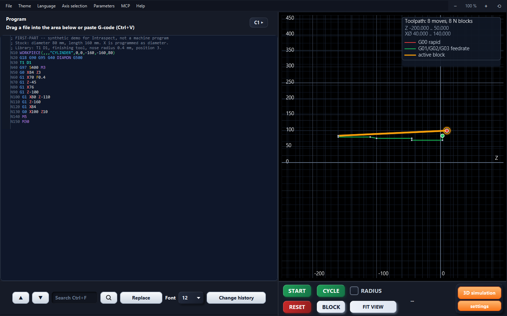
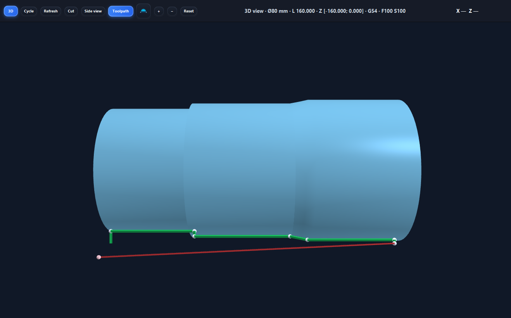

# Intraspect

Проверка и симуляция токарных программ **Siemens SINUMERIK** на Windows.
Откройте G-code, проверьте ошибки, посмотрите траекторию и результат обработки в 3D.

**[Скачать для Windows x64](https://github.com/Docker2201/Intraspect/releases/latest/download/Intraspect-Windows-x64.zip)** · [Первый запуск](docs/quick-start.ru.md) · [Подключить ИИ через MCP](docs/mcp.ru.md) · [English](README.md)

## Запуск за минуту

1. Скачайте ZIP по кнопке выше.
2. Нажмите **«Извлечь всё»**. Можно распаковать сразу на флешку.
3. Откройте **`Intraspect.exe`** внутри папки `Intraspect`.

Java, библиотеки и 3D-компоненты уже внутри. Устанавливать их отдельно, запускать сборку или скачивать что-либо при каждом запуске не нужно. Для работы программы интернет не нужен.

**Не выбирайте GitHub → Code → Download ZIP для установки:** там исходники. Готовая программа находится в [Releases](https://github.com/Docker2201/Intraspect/releases/latest), а в репозитории — в папке [`launch/Intraspect-Windows-x64`](launch/Intraspect-Windows-x64): запускайте `Intraspect.exe` оттуда.

## Что умеет

| Задача | Где это сделать |
|---|---|
| Открыть и изменить программу | **Файл → Открыть**, редактор слева |
| Проверить ошибки и построить траекторию | **СТАРТ**; для двух каналов появится выбор отрисовки |
| Увидеть готовую деталь и процесс резания | **3D симуляция** → **3D** или **Цикл** |
| Настроить станок, заготовку, нули и инструменты | **настройки** |
| Загрузить параметры, два канала и обе стороны детали | **Файл → Открыть набор файлов…** |
| Подключить нейросеть | **МСП → Окно подключения → Подключить нейросеть** |

Есть горизонтальный и карусельный режимы, обработка двух сторон с переворотом, библиотека инструментов, светлая и тёмная темы. Язык интерфейса: русский, English, українська.

## Попробовать без своей программы

Откройте **`samples/first-part.nc`** через меню **Файл → Открыть**.
Если проверка сообщает, что T1 отсутствует, добавьте его предложенным исправлением или в библиотеке инструментов. [Пошаговый пример →](docs/quick-start.ru.md)

## Флешка и обновления

Переносите **папку `Intraspect` целиком**, а не один EXE. Настройки, инструменты и история лежат в `data` рядом с программой. Данные из старой папки `C:\Chekator` не подхватываются.

Для обновления закройте программу, распакуйте новый ZIP отдельно и перенесите свою папку **`data`** к новому EXE. Сначала убедитесь, что всё на месте; старую копию можно оставить как резервную. Библиотеки отдельно обновлять не требуется.

MCP необязателен. Симуляция работает локально; интернет может потребоваться вашему ИИ-клиенту. Доступ ИИ к изменению программы включается отдельно. [Настройка со скриншотом →](docs/mcp.ru.md)

Модель зависит от NC, нулей, размеров заготовки и инструмента. Это средство проверки программы, а не полная эмуляция PLC, патрона и всех перемещений конкретного станка.

## Для разработчиков

Это открытые исходники под MIT: программу можно изменять самому или с помощью ИИ и пересобирать. [Скачать исходники](https://github.com/Docker2201/Intraspect/archive/refs/heads/main.zip). ZIP по кнопке «Скачать для Windows» — готовое приложение со встроенной Java.

[Сборка, тесты и выпуск версии](docs/development.ru.md). Скачанные зависимости сохраняются в кэше; повторно вручную загружать их не нужно. В Git хранятся исходники, готовые ZIP — в Releases.

[Сообщить о проблеме](https://github.com/Docker2201/Intraspect/issues) · [Лицензия MIT](LICENSE)
