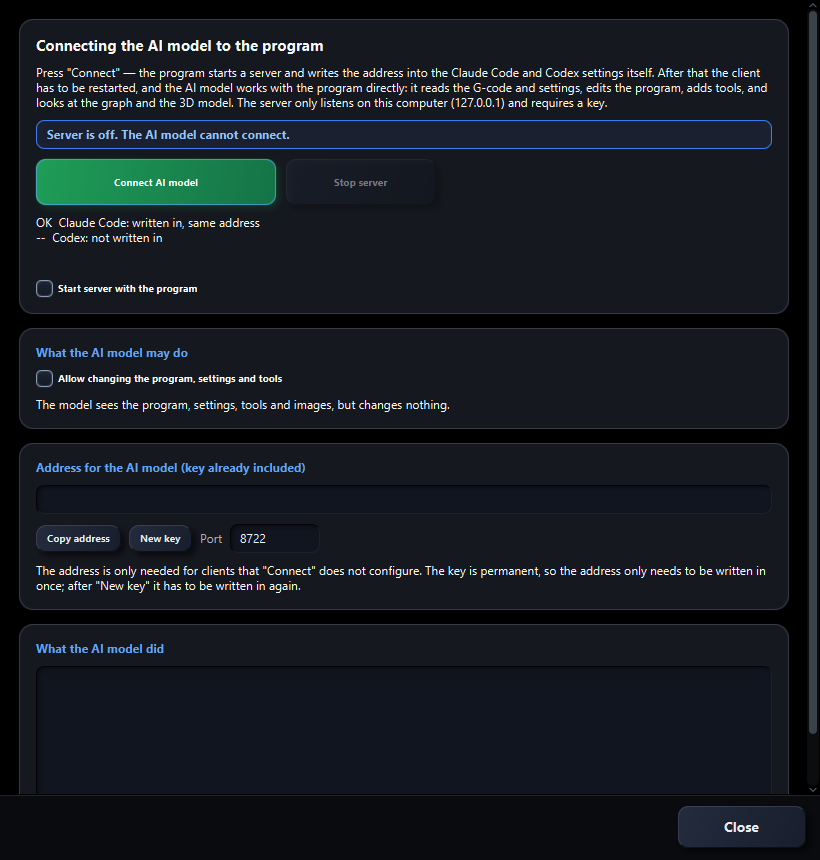

# Connect an AI assistant with MCP

[← README](../README.md) · [Русский](mcp.ru.md)

MCP lets an AI client read the open program, diagnostics, settings and tools, and obtain 2D/3D images. Full access also allows editing NC and controlling playback. Intraspect includes its MCP server; no separate server, Python or Node.js installation is needed for it.

## Codex or Claude Code

1. Open Intraspect and your NC program.
2. Choose **MCP → Connection window**. In the Russian interface, the menu is **МСП**.
3. Click **Connect AI model**. Intraspect starts its local server and adds the connection to existing Codex and Claude Code settings. It shows the result for each client.
4. Restart the AI client. Keep Intraspect open.
5. Ask: **“Use Intraspect MCP to read the current program, check its errors and show the 3D view. Do not change anything yet.”**

The screenshot shows the server switched off. After connecting, the status shows the port and request count; the log records activity.

**Not installed** means the client configuration file was not found. Set up and start Codex or Claude Code first, then try again. Claude Code and Claude Desktop are different clients; automatic setup targets Codex and Claude Code.

## Choose access

- Leave **Allow changes…** unchecked for read-only access to programs, tools, diagnostics and images.
- Enable it to allow NC, settings and tool changes, as well as cycle control.
- Enable **Start server with the program** to start MCP automatically next time.
- **Stop server** disconnects clients. Closing the connection window alone does not stop it.

Example requests:

> Find errors in the current G-code and explain which lines need attention.

> Read the paused 3D cycle: active T/D, block, coordinates and tool time. Capture the current simulation window.

> Compare the radii in the program comments with the tool library. List differences before making changes.

## Other MCP clients

Use a client supporting **HTTP MCP**. Click **Copy address** and configure it as the `intraspect` server URL. It usually looks like `http://127.0.0.1:8722/mcp?key=YOUR_KEY`; use the actual value in your window.

The URL contains an access key. Keep it private and out of screenshots. After **New key**, click **Rewrite settings** and restart the client.

The server listens only on this computer (`127.0.0.1`). A cloud chat without a local MCP client cannot connect directly. Intraspect works offline; your chosen AI client may send the data it reads to its provider.

## Troubleshooting

| Symptom | Check |
|---|---|
| Server is off | Click **Connect AI model** |
| Port is busy | Close the other Intraspect instance or choose a free port, then reconnect |
| Client cannot see tools | Restart the client after changing its configuration |
| Invalid key | Copy the address again or click **Rewrite settings** |
| Editing is denied | Enable full access if you want the client to make changes |
| No live cycle image | Open **3D simulation** first; the capture uses that window |

Read tools include `get_program`, `check_program`, `get_settings`, `get_tool_library`, `get_toolpath`, `render_graph`, `render_3d`, `get_simulation_state` and `render_simulation_view`. Write tools include `set_program`, `set_settings`, `save_tool`, `remove_tool` and `control_simulation`.
